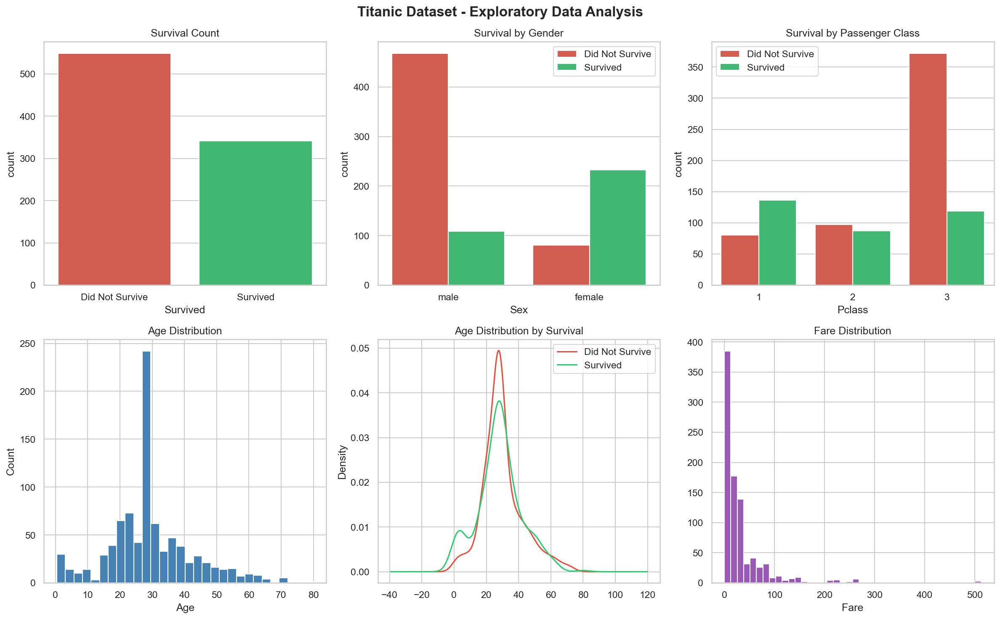
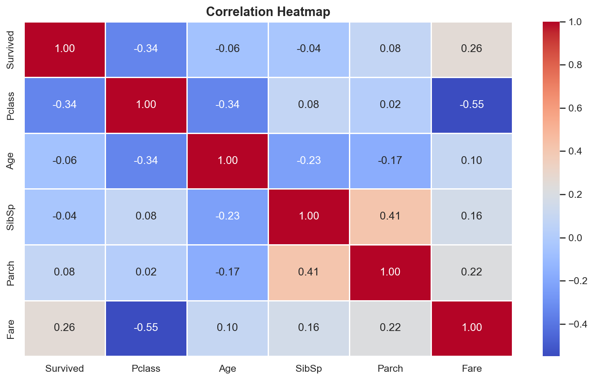
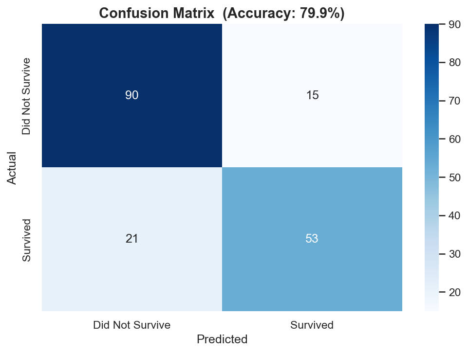
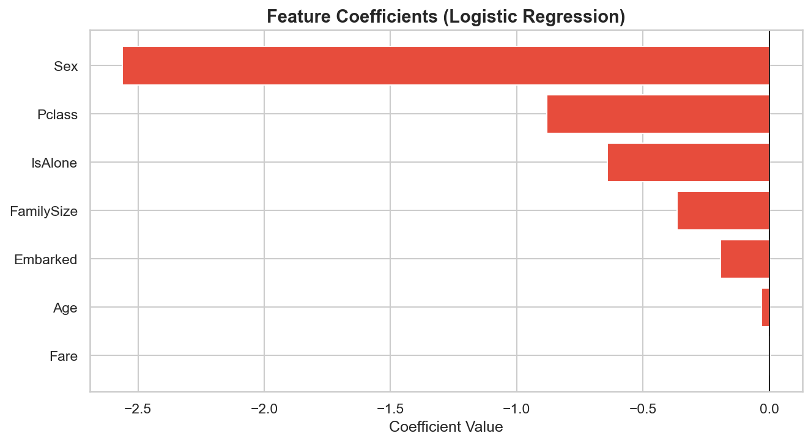

# 🚢 Titanic Survival Prediction

> Machine Learning Project using Python

---

## 📌 Project Overview

This project predicts whether a passenger survived the Titanic disaster using Machine Learning.
It covers the complete data science pipeline including data cleaning, visualization, feature engineering, model building, and evaluation.

---

## ⚙️ Tools & Technologies

* Python
* Pandas
* NumPy
* Matplotlib
* Seaborn
* Scikit-learn

---

## 📊 Features Used

* Pclass
* Sex
* Age
* Fare
* Embarked
* FamilySize
* IsAlone

---

## 🔍 Project Steps

1. Data Collection
2. Data Cleaning
3. Data Visualization (EDA)
4. Feature Engineering
5. Model Building (Logistic Regression)
6. Model Evaluation

---

## 🤖 Model Used

**Logistic Regression**

---

## 📈 Model Performance

* Accuracy: ~80%
* Evaluation Metrics:

  * Confusion Matrix
  * Classification Report

---

## 📊 Visualizations

### Exploratory Data Analysis

### Correlation Heatmap

### Confusion Matrix

### Feature Importance

---

## 🚀 How to Run

### 1. Install dependencies

pip install pandas numpy matplotlib seaborn scikit-learn

### 2. Run the project

python titanic_project.py

---

## 📁 Project Files

* titanic_project.py
* eda_plots.png
* heatmap.png
* confusion_matrix.png
* feature_importance.png
* Titanic_Project_Report.docx

---

## 🧠 Key Insights

* Female passengers had higher survival rate
* 1st class passengers survived more
* Younger passengers had better survival chances
* Passengers traveling alone had lower survival rate

---

## 📌 Conclusion

This project demonstrates how machine learning can be applied to real-world data to extract insights and make accurate predictions.

---

## 👨‍💻 Author

**Yash**
